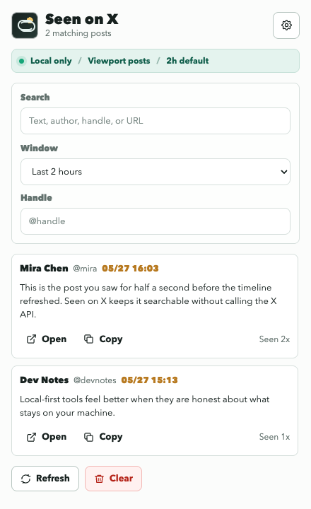
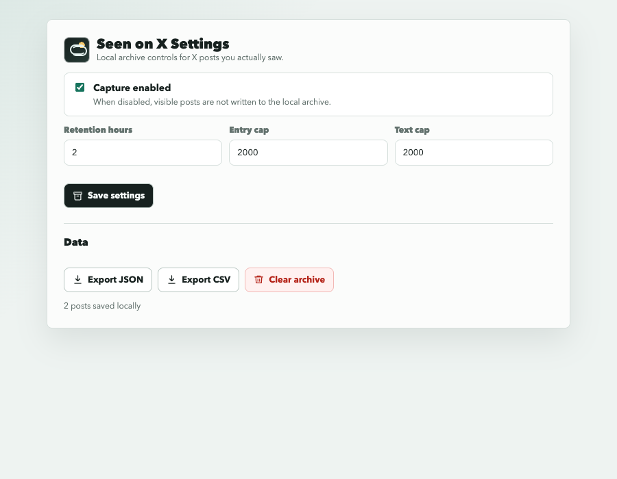

# Seen on X

Find posts you saw before the X timeline refreshed.

Seen on X solves a specific browsing problem: you refresh or navigate away from X, realize you saw something worth saving, and cannot find it again because you never opened the individual post URL.

This extension records only posts that visibly enter your browser viewport. It stores the author, handle, text, post URL, source URL, and seen timestamps in your browser's local IndexedDB.





## Privacy model

- Local-first: captured posts stay in your browser storage.
- No X API usage.
- No auto-scroll, bulk crawling, or background timeline fetching.
- No remote sync or analytics.
- No direct message capture by design.

This project is not affiliated with X Corp.

## Features

- Capture visible X timeline posts after a short viewport dwell.
- Search by text, author, handle, or URL.
- Filter by recent time window.
- Open original posts when a status URL is available.
- Copy captured text.
- Configure retention hours, maximum entries, and text length.
- Export JSON or CSV.

## Install from source

```bash
pnpm install
pnpm build
```

Then load the extension:

1. Open `chrome://extensions` or `edge://extensions`.
2. Enable Developer mode.
3. Choose **Load unpacked**.
4. Select the `dist` directory.

## Development

```bash
pnpm test
pnpm typecheck
pnpm build
```

The extension is built with TypeScript, Vite, Manifest V3, and IndexedDB.

## Current limitations

- First version targets Chrome and Edge.
- DOM extraction can break if X changes its markup.
- There is no screenshot/OCR fallback.
- There is no cloud sync.
